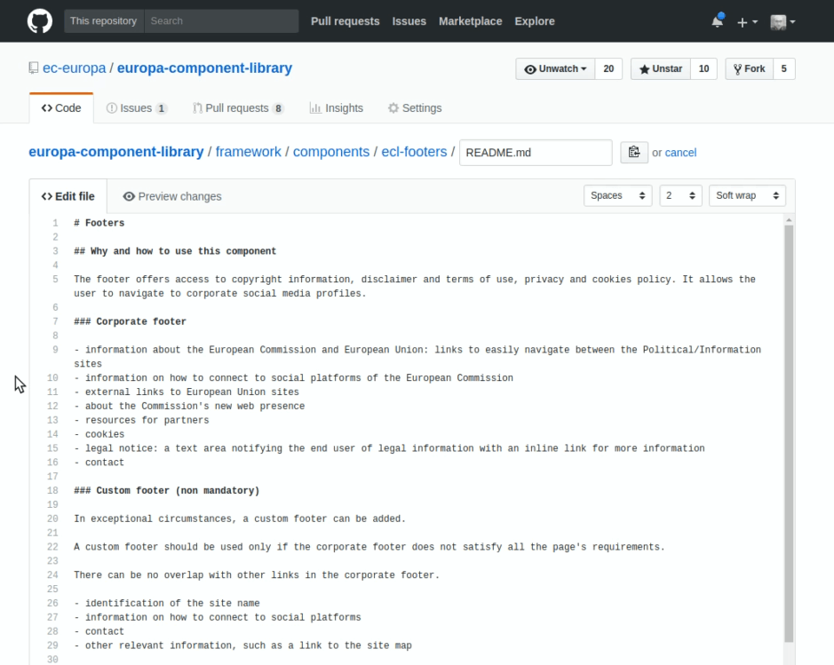
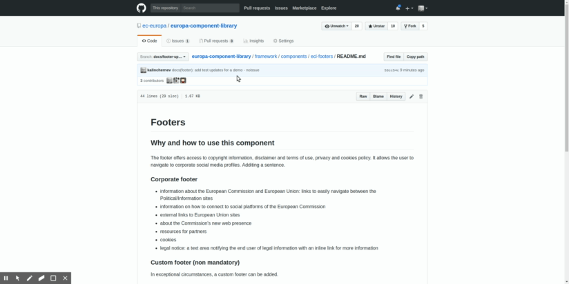

# How to update documentation on ECL

This page explains how to update the documentation directly on GitHub.

## Prerequisite

If you don't already have an account on [GitHub](https://github.com/login), make
sure to create one and log in with it.

You also have to be part of team
[ECL doc editors](https://github.com/orgs/ec-europa/teams/ecl-doc-editors/). For
an invite, please contact an owner of
[ec-europa](https://github.com/orgs/ec-europa/people?utf8=%E2%9C%93&query=%20role%3Aowner).

## Step 1: Locate the file you want to update

Locate the page to edit.

To edit components related pages
`europa-component-library/src/systems/{SYSTEM}/specs/components/{COMPONENT}/docs/{PAGE}.md`

or more generally
`europa-component-library/src/systems/{SYSTEM}/specs/{SECTION}/**/{PAGE}.md`

To edit pages from the site (not linked to a specific item like the splash page):
`europa-component-library/website/src/pages/index.md`

## Step 2: Edit the documentation

- Make any modification you wish by using the markdown editor. Here is a
  [cheatsheet for markdown syntax](https://guides.github.com/features/mastering-markdown/).

- You can see the result directly by switching to the "Preview" tab.

See how to do this step

## Step 3: Save updates to a new branch

- After you have modified the file, you have to commit the changes to save them
  in your branch.

- Enter title and description based on our [naming conventions](./conventions/git.md).

- Click on "create a new branch".

- This will save changes on your branch.

## Step 4: Open a pull request

- Once you made sure you have saved changes on your particular branch, you are
  ready to proceed on proposing these changes to the main `v2` branch which
  is where you see the documentation in production.

- You can simply use the hints which GitHub gives you when you go to the root of
  the repo after saving your changes.

- Do not forget to add `tag: documentation` on your pull request which is used
  for the release log.

See how to do this step

## It's done!

Your pull request will be briefly reviewed by our team, so that there are no
linting issues and if all checks are green, changes will be integrated with the
v2 ECL branch in short time.

Thank you!

---

### Note: writing convention

We are using writing conventions for both
[pull requests](./conventions/git.md)
and
[markdown](./conventions/markdown.md).
You can optionally apply these conventions to facilitate documentation update
process.

In any case, we will have to apply the conventions on our side before publishing
it (so the content may be slightly modified).
