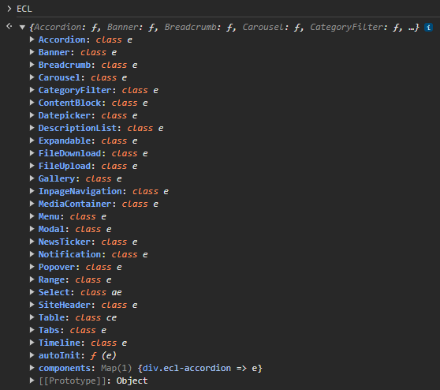

# JavaScript

ECL provides an un-opinionated set of components' behaviors. In rare occasions, some components such as the date picker might use external libraries which integrate typical behaviors.

Components do not depend on jQuery and provide consistent APIs which can be managed centrally through the global `ECL` JavaScript module.

## How to use

There are two ways to use ECL JavaScript: via global IIFE bundle or ESM imports.

### Option 1: Global IIFE (Browser)

Include the JavaScript file of `ecl-ec.js` or `ecl-eu.js` provided in the [latest release package](https://github.com/ec-europa/europa-component-library/releases). This file contains a JavaScript module called `ECL` which is an [IIFE](https://developer.mozilla.org/en-US/docs/Glossary/IIFE) built by the [`ecl-builder` utility](https://www.npmjs.com/package/@ecl/builder).

```html
<script src="https://cdn1.fpfis.tech.ec.europa.eu/ecl/v5.0.0-alpha.18/ec/scripts/ecl-ec.js"></script>
```

This creates a global `ECL` object which contains the components' factory functions.



### Option 2: ESM (Modern JavaScript)

Install the preset via npm and import only what you need:

```bash
npm install @ecl/preset-ec
```

```javascript
// Import specific components
import { Accordion, Modal } from '@ecl/preset-ec';

// Or import autoInit utility
import { autoInit } from '@ecl/preset-ec';
```

## Version in use

You can get the ECL version you are using running `ECL.version` in the console of your devtools.

## Instantiation

Each component contains `.init()` and `.destroy()` methods.

### Auto-initialization (Recommended)

The simplest approach is to use the `.autoInit()` method which automatically initializes all components on the page:

**Global IIFE:**

```js
document.addEventListener('DOMContentLoaded', function () {
  ECL.autoInit();
});
```

**ESM:**

```javascript
import { autoInit } from '@ecl/preset-ec';

document.addEventListener('DOMContentLoaded', () => {
  autoInit();
});
```

### Manual initialization

You can also manually initialize individual components:

**Global IIFE:**

```js
const element = document.querySelector('[data-ecl-accordion]');
const accordion = new ECL.Accordion(element);
accordion.init();
```

**ESM:**

```javascript
import { Accordion } from '@ecl/preset-ec';

const element = document.querySelector('[data-ecl-accordion]');
const accordion = new Accordion(element);
accordion.init();
```

### Retrieving instances

All component instances are stored in a global Map and can be retrieved:

**Global IIFE:**

```js
const element = document.querySelector('[data-ecl-accordion]');
const instance = ECL.components.get(element);
```

**ESM:**

```javascript
import { components } from '@ecl/preset-ec';

const element = document.querySelector('[data-ecl-accordion]');
const instance = components.get(element);
```

### Destroying components

Always clean up component instances when they're no longer needed:

```javascript
instance.destroy();
instance.init(); // Re-initialize if needed
```

For more details regarding ECL's autoInit method, follow the [package's README.md file](https://github.com/ec-europa/europa-component-library/blob/v5-dev/src/tools/dom-utils/autoinit/README.md).

## Component Options

Most components accept options during initialization:

```javascript
const modal = new ECL.Modal(element, {
  // Custom options
  dismissOnClickOutside: true,
  dismissOnEscape: true,
});
modal.init();
```

## Event Handling

Components emit custom events that you can listen to:

```javascript
const accordion = new ECL.Accordion(element);
accordion.init();

// Listen to events
accordion.on('onOpen', (event) => {
  console.log('Accordion opened', event);
});

accordion.on('onClose', (event) => {
  console.log('Accordion closed', event);
});
```

**Available events** vary by component. Common events include:

- `onInit` - Component initialized
- `onOpen` - Component opened (modals, accordions, etc.)
- `onClose` - Component closed
- `onDestroy` - Component destroyed

## Component API Reference

Each component has detailed API documentation on ECL's website. For example:

- Accordion: https://ec.europa.eu/component-library/ec/components/accordion/api/
- Modal: https://ec.europa.eu/component-library/ec/components/modal/api/

The API documentation includes:

- Available options
- Methods
- Events
- Usage examples
